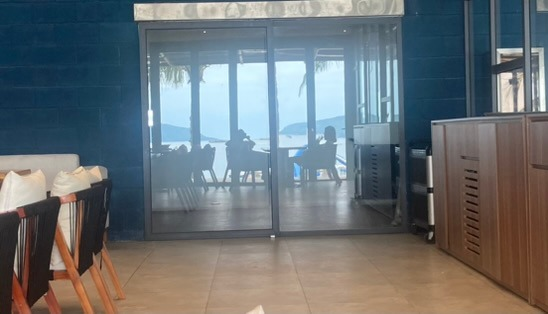

Tắm bãi Tiên Sa đàng hoàng nha. Nhưng bãi Tiên Sa không có tiên mà toàn bộ đội thực
tập đào công sự. Bãi tắm đẹp, nước êm, chung quanh có núi che, nếu tạm quên có cái
cảng ở bên kia mỏm núi thì còn phê ác.

Khách sạn vắng khách, đầu tiên thấy một cô chắc người Đức xuống ngồi ăn một mình.
Mình tự hỏi trường hợp này thế nào, đi ba lô một mình sao không ở trong phố (bãi
Tiên Sa cách trung tâm độ 15km). Mãi một lúc sau ông chồng/bồ mới xuất hiện. Trăng
mật không giống trăng mật, mà vợ chồng lâu ngày cũng không giống. Có thể là quen
nhau lâu, hôm nay đi hâm nóng, nhưng thói quen khó bỏ: em xuống trước, anh nằm nướng
một tí rồi xuống.

Chắc họ cũng không ngờ bãi đẹp như tiên, nhưng vắng như chùa (Bà Đanh). Đơn giản vì
Đà Nẵng biển đẹp kéo dài.

Âm mưu của mình là hôm nào đó check in vào khách sạn Hải Quân kế bên.
