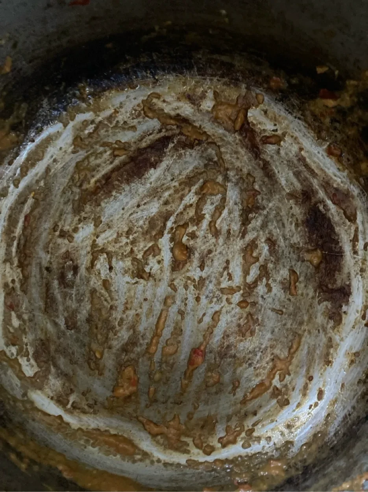

Hôm qua nấu nồi cà ri truyền thống: lục trong tủ lạnh thấy mớ rau ngò gần héo,
quả ớt ngọt để đã mấy tuần, hũ yaourt hết đát từ lâu, ít kem tươi không còn
tươi nữa. Thế là thêm củ hành nữa, xay nhuyễn tất cả. (Chỗ này chưa được truyền
thống, truyền thống là phải giã bằng cối.)

Bỏ bột cà ri Madras vào, rồi lọc mấy cái đùi gà bỏ vào ướp. Sau đó bỏ tất cả vào
nồi xào, rồi nấu lên. Lại mua được flatbread giảm giá.

Sáng nay ăn một bữa no, chỉ còn hình cái nồi không.

