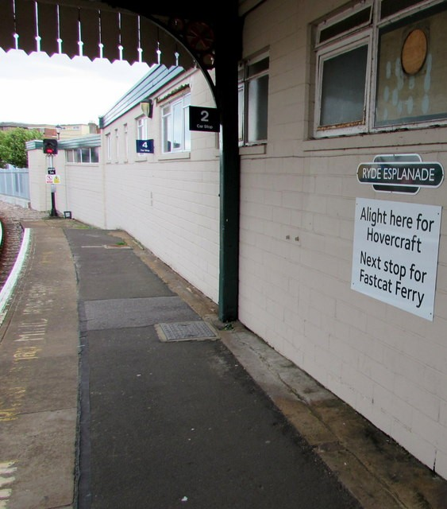

_Đã đăng trên [VnExpress](https://vnexpress.net/for-ben-thanh-giup-tram-dung-metro-so-1-duyen-dang-hon-4835417.html)
ngày 4/1/2025; bản tiếng Anh trên
[VnExpress International](https://e.vnexpress.net/news/perspectives/readers-views/for-ben-thanh-signage-reflects-ben-thanh-suoi-tien-metro-line-s-unique-charm-4836076.html)
ngày 6/1/2025._

Là một Việt kiều đang sinh sống và làm việc tại Anh được hơn nửa đời người, thời gian
qua, tôi rất tò mò và theo dõi khá kỹ cuộc tranh luận của người Việt về việc sử dụng biển
chỉ dẫn "To Ben Thanh" hay "For Ben Thanh" tại tuyến Metro đầu tiên của TP HCM.

Bản thân tôi có quen một Tiến sĩ Ngôn ngữ học máy tính (Computational Linguistics) ở Anh.
Đem câu chuyện này và hỏi người đó xem sử dụng "To Ben Thanh" hay "For Ben Thanh" mới
đúng, tôi nhận được câu trả lời nguyên văn như sau:

"While ‘For Ben Thanh’ might feel unconventional compared to more standard phrasing like
‘To Ben Thanh,’ it is grammatically correct in the context of metro signage, where it
implies direction or service. That said, its slightly old-fashioned tone adds charm to
the station, reflecting the unique cultural blend of a globalized yet distinctly local
city like Ho Chi Minh", vị Tiến sĩ kia giải thích.

Xin tạm dịch ra tiếng Việt nội dung câu trả lời trên để quý độc giả hiểu rõ: "Dù cụm từ
'For Ben Thanh' có thể cảm giác hơi không quen thuộc so với cách diễn đạt tiêu chuẩn như
'To Ben Thanh', nhưng nó vẫn đúng ngữ pháp trong ngữ cảnh biển báo tại các trạm Metro -
nơi nó ám chỉ hướng đi hoặc dịch vụ. Tuy nhiên, sắc thái hơi cổ điển của cụm từ này lại
tạo thêm phần duyên dáng cho trạm Metro, phản ánh sự hòa quyện độc đáo giữa văn hóa toàn
cầu và bản sắc địa phương đặc trưng của một thành phố như TP HCM".

Hy vọng đây là một câu trả lời hợp lý cho bài toán sử dụng "To Ben Thanh" hay "For Ben
Thanh" cho trạm dừng Metro Bến Thành - Suối Tiên.

_Sân ga Ryde Esplanade, đảo Wight: “Alight here for Hovercraft”. Ảnh: Jaggery,
[Geograph](https://www.geograph.org.uk/photo/4661879),
[CC BY-SA 2.0](https://creativecommons.org/licenses/by-sa/2.0/)._

---

**Tái bút.** Đây là lần đầu tiên trong đời tôi viết gửi báo. Cuộc tranh luận “to” hay
“for” làm tôi bực quá, nhất là khi một blogger nổi tiếng gọi tấm biển là “ngô nghê”. Tôi
thấy mình phải nói một điều gì đó. Bình thường thì chả bao giờ tôi gửi bài lên đấy làm
gì, chẳng qua là cảm xúc nó trào ra thôi. Ở Anh, sân ga vẫn ghi “alight here for…”, “next
stop for…”, như tấm biển ở trên. Quy ước của ai, ngô nghê với ai?
