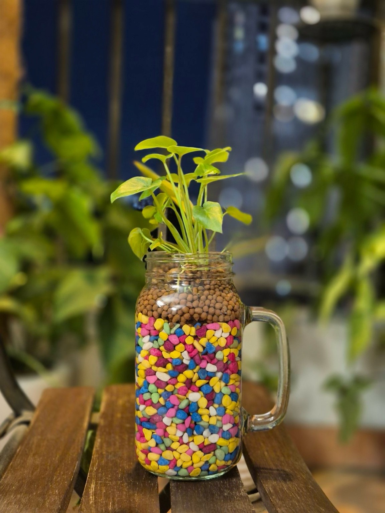

_Một người bạn gửi tấm ảnh này và thách: viết một câu chuyện._

Trên ban công tầng năm, một nghệ nhân già ngồi lặng lẽ, tay vuốt những viên sỏi
màu sắc như thói quen hằng ngày. Mỗi viên sỏi trong chiếc ly thủy tinh ấy đã được
ông lựa chọn kỹ lưỡng: không quá lớn, không quá sắc cạnh, và nhất định phải có
màu vui tươi, như để bù lại cái thế giới xám xịt ông vẫn dõi theo từ khung cửa.

Đối diện ban công là một dãy chung cư cũ kỹ. Ông chẳng còn nhớ mình đã ngồi bao
nhiêu buổi chiều mà không có mục đích gì ngoài việc ngắm. Tầng trên có đôi vợ
chồng trẻ, người chồng thường gào lên, người vợ thường khóc. Một lần, ông nghe
tiếng đồ vật vỡ, rồi im bặt. Hôm sau, cửa sổ ấy đóng im lìm như chưa từng tồn tại
con người.

Ngay phía dưới, căn phòng luôn tắt đèn suốt bao năm. Ông từng tưởng là bỏ hoang,
nhưng một hôm có con mèo lẻn ra ban công, mắt sáng như lửa trong đêm. Rồi lại
tối. Ông không biết ai sống trong ấy, hay có ai sống không.

Một ô cửa khác thì chớp nháy liên hồi, ánh đèn tím xanh hắt ra cả hành lang. Ông
thấy vài bóng người lắc lư, cười ngặt nghẽo rồi gục xuống. Những người trẻ đó, họ
sống vội như thể đang đốt cháy mọi thứ, cả tuổi trẻ, cả đêm.

Ông quay lại nhìn cái cây bé nhỏ của mình, mọc từ một ly thủy tinh trong veo.
Những viên đất nung, lớp sỏi màu sắc bên dưới: một thế giới khác, nơi mọi thứ đều
có trật tự. Cây chẳng cần biết bên ngoài có cãi vã, hoang tàn hay điên loạn. Nó
chỉ cần chút nắng, chút nước, và bàn tay ông.

Ông cắm thêm một viên sỏi vàng vào chỗ trống nhỏ xíu vừa phát hiện. Rồi mỉm cười.
Ở đây, trong không gian chỉ rộng bằng một chiếc ghế gỗ cũ, ông là người duy nhất
quyết định cái gì nên nằm ở đâu.
